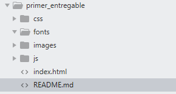

# **Primer Entregable** - Proyecto final Front End
## Requisitos generales
El proyecto a realizar será un **portafolio personal** el cual servirá para presentar los trabajos realizados, tanto durante el bootcamp como trabajos previos. Esta será visible por medio de un landing page que contará con algunos elementos como una barra de navegación, slider, sección donde detallará el perfil profesional, las habilidades, galería fotográfica donde se presentarán los trabajos, un formulario de contacto y un footer que redirija a redes sociales.

## Estructura de directorios
* Entregable
	* README.md
	* Index
	* css
		* style.css

	* img 
		* imagenes
	* js	
